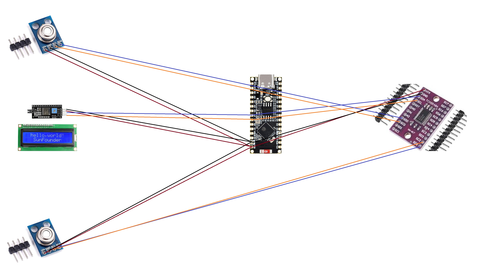

# Motorcycle Tire Temperature Monitor

An ESP32-based system that reads real-time tire temperatures using IR sensors and displays them on an LCD while hosting a web server that graphs the data over time. Built as a practical tool for track days to monitor tire heat and determine when tires are up to optimal operating temperature.

---

## How It Works

Two MLX90614 IR temperature sensors are pointed at each tire and connected through a TCA9548A I2C multiplexer (which allows multiple sensors sharing the same I2C address to coexist on one bus). The ESP32 reads both sensors and does two things simultaneously:

- Displays current temps on a 16x2 LCD in real time
- Hosts a web server (via mobile hotspot) that graphs temperature over time so you can see how your tires are heating up through a session
  
  

---

## Hardware

| Component | Purpose |
|---|---|
| ESP32S3 Development Board | Microcontroller / web server host |
| MLX90614 IR Temp Sensor ×2 | One per tire |
| TCA9548A I2C Multiplexer | Allows multiple same-address sensors on one bus |
| 16×2 LCD Display | Real-time temp readout |
| Breadboard + Wire | Prototyping |
| Mobile Hotspot | Network for the web server |

Refer to `WireDiagram.jpg` for wiring.

---

## Setup

1. Install [Arduino IDE](https://www.arduino.cc/en/software)
2. Add ESP32 board support via the Arduino Boards Manager
3. Install the following libraries:
   - `Adafruit MLX90614`
   - `LiquidCrystal_I2C`
   - `WiFi` (bundled with ESP32 board package)
4. Wire components according to `WireDiagram.jpg`
5. Update the WiFi credentials in `MotorcycleProject.ino` with your hotspot SSID and password
6. Upload and open Serial Monitor to find the ESP32's IP address
7. Navigate to that IP on any device connected to the same hotspot

---

## Notes & Future Improvements

This was built on a budget with two sensors — one per tire. Ideally you'd run three sensors per tire (inside, center, outside edge) since tire heat isn't uniform across the contact patch. The multiplexer supports up to 8 devices so adding more sensors would just be a wiring change with minor code updates.
